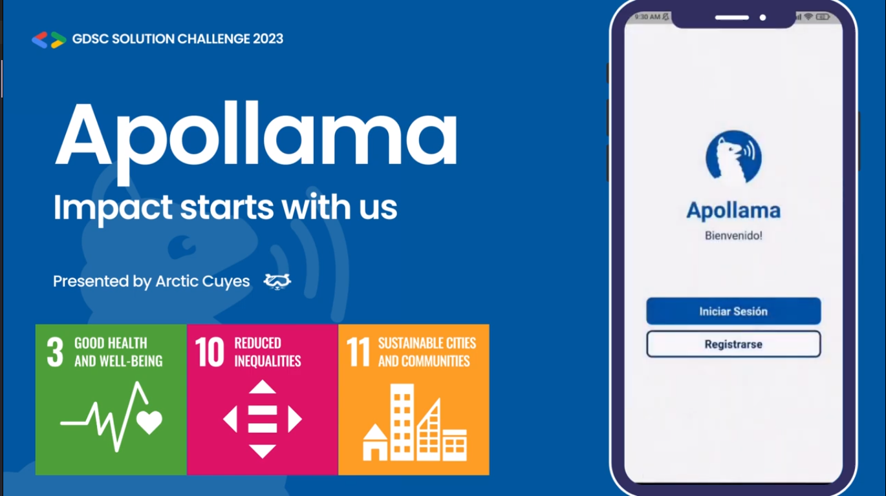

<h1 align="center"> Apollama </h1>  

    

<h3 align="center">
  2023 Solution Challenge
</h3>

  

## Table of Contents

- [Table of Contents](#table-of-contents)
- [Introduction](#introduction)
- [Features](#features)
- [Contributors](#contributors)
- [Demo](#demo)
- [Powered by](#powered-by)

<!-- END doctoc generated TOC please keep comment here to allow auto update -->

## Introduction
**UN Sustainable Goals Addressed:** 

  

Apollama is a social networking app designed to bring local communities together and facilitate communication and collaboration among members. With Apollama, users can discover and share information about local issues and events, and offer and receive help from others in their community. It's an easy and convenient way to stay informed, engaged, and connected with the people around you.

  

## Features

A few of the things you can do with Apollama:

* Top-notch user authentication system with secure login methods like email, Google, and Facebook.
* Newsfeed feature that allows you to quickly and easily stay up-to-date on all the local issues and events happening in your community, with access to relevant posts and events on a map.
* Find posts by category, including notices, aid, activities, pets, and health-related information, and rate the relevance of each post to promote the most useful content for your community.
* Integration with Google Maps API, allowing you to find and discover relevant events and posts near you on a map with markers indicating their categories.
* The option to create and share your own posts about local issues or events you come across, with easy management of your profile and access to your recent posts right from your profile page.

  

  

## Contributors

This project was made possible by these wonderful team, called Arctic Cuyes (Cuyes means guinea pigs in Spanish):

## Demo

## Powered by 

The following tools were used to build this project:

